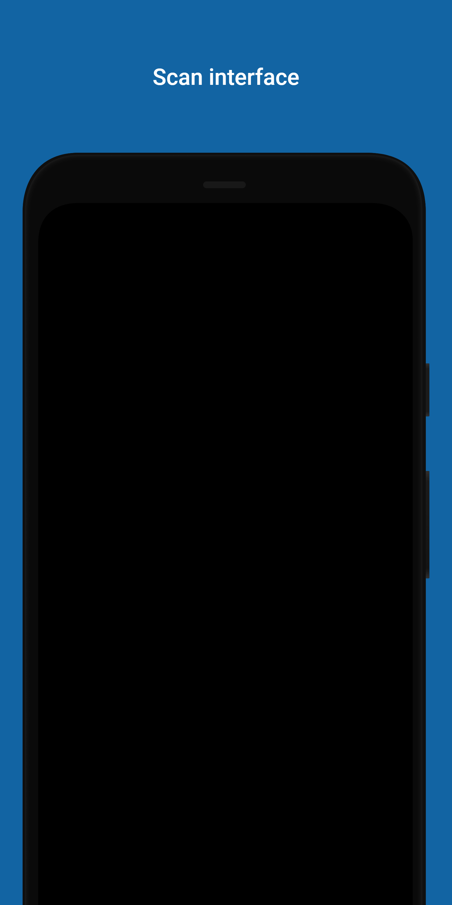
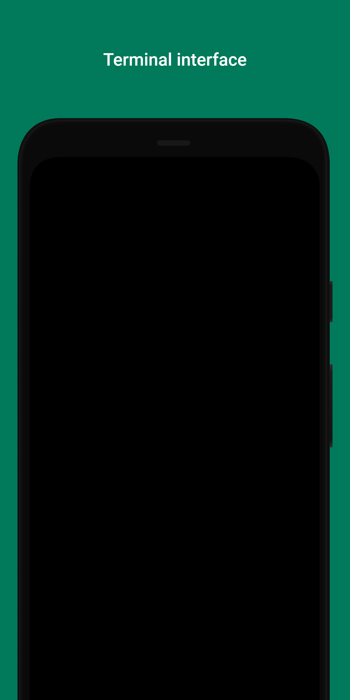
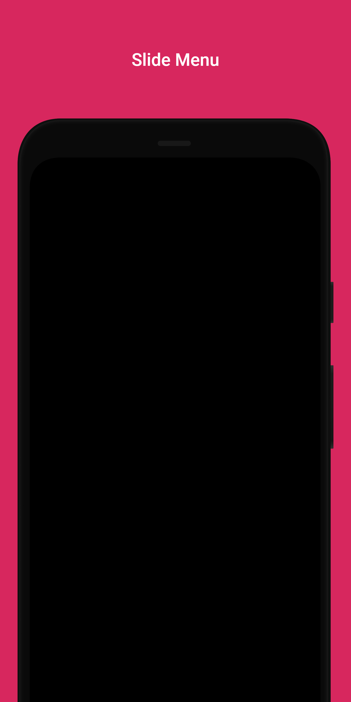
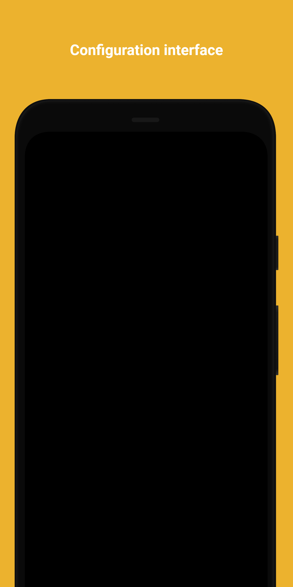

    

<h2 align="center">BLE Terminal Product Requirements Document (PRD)

</h2>

    Version 1.0.0 

    This Product Requirements Document (PRD) describes all the specifications and product requirements for the BLE Terminal. 

    Jhon Alejandro Sanchez - Scrum, QA (alejandross1811@gmail.com)  
    Johan Sebastian Gomez - Head of backend Develop (johango5@hotmail.com) 

<table>
    <tr>
        <td><strong>Target Release</strong></td>
        <td>1.0</td>
    </tr>
    <tr>
        <td><strong>Document Status</strong></td>
        <td>DRAFT</td>
    </tr>
    <tr>
        <td><strong>Document Owner</strong></td>
        <td>Jhon Alejandro Sanchez</td>
    </tr>
    <tr>
        <td><strong>Designers</strong></td>
        <td>Jhon Alejandro Sanchez, Johan Sebastian Gomez</td>
    </tr>
    <tr>
        <td><strong>Head Developer</strong></td>
        <td>Johan Sebastian Gomez</td>
    </tr>
    <tr>
        <td><strong>QA</strong></td>
        <td>Jhon Alejandro Sanchez</td>
    </tr>
</table>

### Requirements

<table>
    <tr>
        <td><strong>#</strong></td>
        <td><strong>User Story Title</strong></td>
        <td><strong>User Story Description</strong></td>
        <td><strong>Priority</strong></td>
        <td><strong>Notes</strong></td>
    </tr>
    <tr>
        <td><strong>1</strong></td>
        <td>BLE integration</td>
        <td>a user need a BLE integration in order to connect via bluetooth with differents devices </td>
        <td>Must Have</td>
        <td>1.0</td>
    </tr>
    <tr>
        <td><strong>2</strong></td>
        <td>Scan Interface</td>
        <td>A user wants to see a simple scan interface where he can check available devices and connect via bluetooth</td>
        <td>Must Have</td>
        <td>1.0</td>
    </tr>
    <tr>
        <td><strong>3</strong></td>
        <td>Terminal Interface</td>
        <td> A user wants to see a simple terminal so they can get a visualization of the data that is being seending via bluetooth</td>
        <td>Must Have</td>
        <td>1.0</td>
    </tr>
    <tr>
        <td><strong>4</strong></td>
        <td>Slide Menu</td>
        <td>A user wants to see a slide menu where they can change between interfaces</td>
        <td>Must Have</td>
        <td>1.0</td>
    </tr>
    <tr>
        <td><strong>5</strong></td>
        <td>Logo</td>
        <td>A user wants to see the bluetooth Logo</td>
        <td>Should Have</td>
        <td>1.0</td>
    </tr>
    <tr>
        <td><strong>6</strong></td>
        <td>Donation Button</td>
        <td>A user wants to donate to the project</td>
        <td>Should Have</td>
        <td>1.0</td>
    </tr>
    <tr>
        <td><strong>7</strong></td>
        <td>Log Save</td>
        <td>A user wants to storage the data that is being vizualized into a log </td>
        <td>Should Have</td>
        <td>1.0</td>
    </tr>
    <tr>
        <td><strong>8</strong></td>
        <td>Configuration Menu</td>
        <td>A user wants to Configurate the APP</td>
        <td>Should Have</td>
        <td>1.0</td>
    </tr>
</table>

### User Interaction and design

[//]: # (TODO: Change images desing with the prototipe preview of the real app)

<table>
    <tr>
        <td><strong>Description</strong></td>
        <td><strong>Scan Menu (Default)</strong></td>
        <td><strong>Terminal Menu</strong></td>
        <td><strong>Slide Menu</strong></td>
        <td><strong>App Configuration Menu</strong></td>
    </tr>
    <tr>
        <td><strong>Mockup</strong></td>
        <td>  </td>
        <td></td>
        <td></td>
        <td></td>
    </tr>
<table>

### Not Doing
* Wide range of android version compatibility - out of scope, we are focusing on newer android version (Android 6 onwards).
* IOs Compatibility - Out of scope, we are only focusing on android devices but a migration could be performed once the final release arrives.
* Mobile web view - this project is a native app make it on android studio.
* Online mode - although at the moment we are not pretenging to use internet for any feature, We could consider adding features that could use internet connection like metrics.
